# 靜態精靈圖預覽入口

> 這是目前所有非 Boss 角色的 GIF 驗收入口。直接在 Markdown 預覽中往下看，即可逐組檢查動作；Boss／小 Boss 不在此入口。

目前共 **14 個角色、86 組 GIF 預覽**。每組 GIF 對應同名的獨立 PNG 幀序列。

> 預覽節奏已調慢為原本的 3 倍：每幀停留時間為 240／360／420 毫秒（依各組原始設定而定）。PNG 幀沒有被修改。

## 使用方式

- 先看每個角色的 `base-float-move`，確認本體中心與比例。
- 再看 `hit`、`death` 與技能組；角色本體不應突然跳位。
- `projectile`／`effect` 是獨立素材，只驗收效果形狀與可調整性。
- 共用規格：[靜態精靈圖生成總規格](靜態精靈圖生成總規格.md)。

## Level 1

### 求援幼年海馬

| 圖組 | GIF 預覽 |
|---|---|
| `基礎漂浮／常態移動` <small>base-float-move</small> | 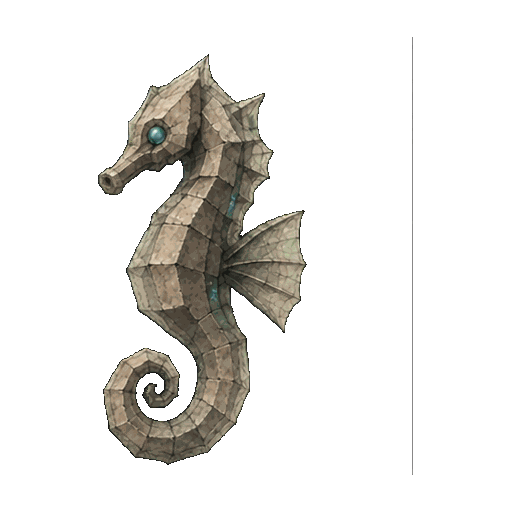 |
| `死亡 90 度旋轉` <small>death-rotate-90</small> | 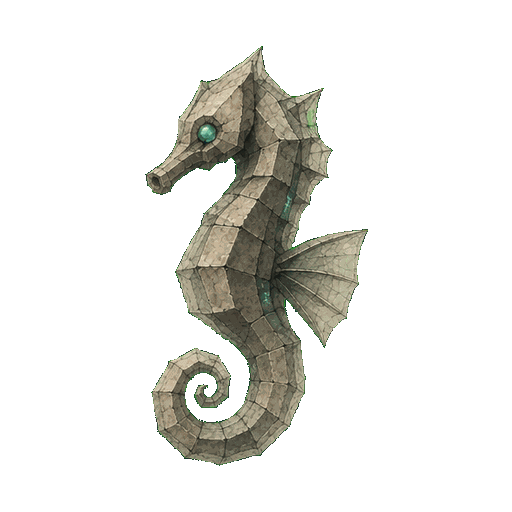 |
| `受擊紅遮罩` <small>hit-red-mask</small> |  |
| `求援呼叫` <small>rescue-call</small> | 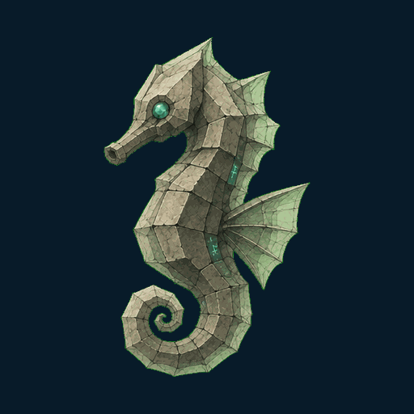 |

### 爆腹燈籠魚

| 圖組 | GIF 預覽 |
|---|---|
| `基礎追擊／移動` <small>base-chase-move</small> | 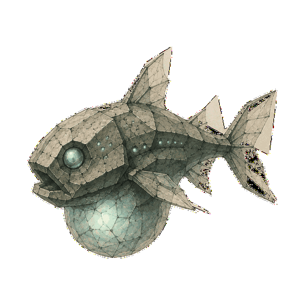 |
| `基礎漂浮／常態移動` <small>base-float-move</small> | 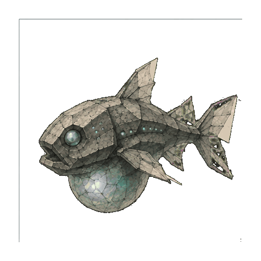 |
| `死亡 180 度旋轉` <small>death-rotate-180</small> |  |
| `受擊紅遮罩` <small>hit-red-mask</small> | 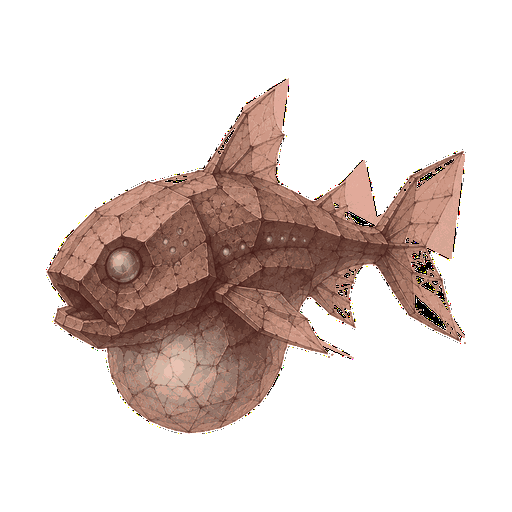 |
| `自爆追擊` <small>self-destruct-chase</small> | 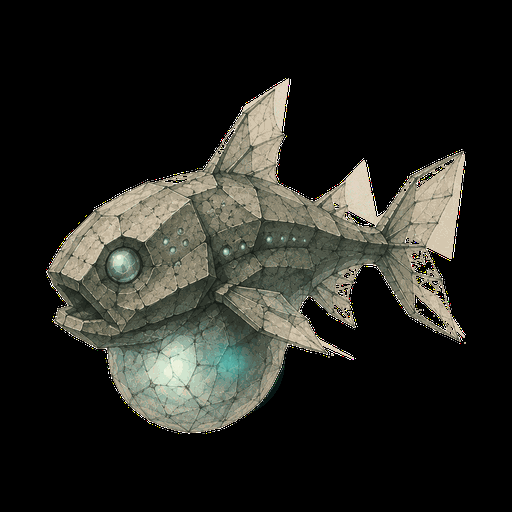 |

## Level 2

### 獅子魚砲手

| 圖組 | GIF 預覽 |
|---|---|
| `attack-cannon-pose` <small>attack-cannon-pose</small> |  |
| `attack-effect-neutral` <small>attack-effect-neutral</small> | 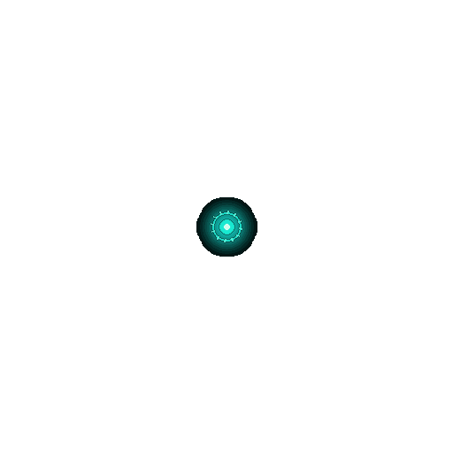 |
| `attack-effect-on-lionfish` <small>attack-effect-on-lionfish</small> | 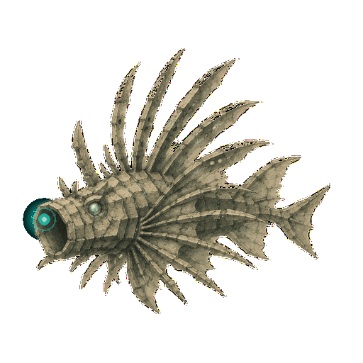 |
| `基礎漂浮／常態移動` <small>base-float-move</small> |  |
| `死亡 180 度旋轉` <small>death-rotate-180</small> |  |
| `受擊紅遮罩` <small>hit-red-mask</small> | 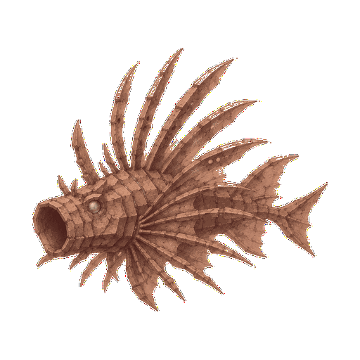 |
| `skill-poison-spike-shot` <small>skill-poison-spike-shot</small> |  |
| `skill-spine-scatter-shot` <small>skill-spine-scatter-shot</small> | 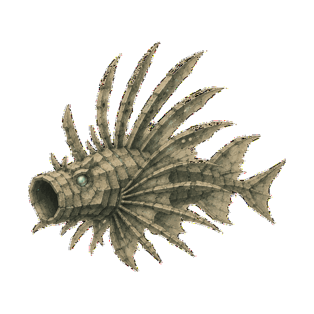 |

### 魷魚刺客

| 圖組 | GIF 預覽 |
|---|---|
| `attack-ink-sniper` <small>attack-ink-sniper</small> | 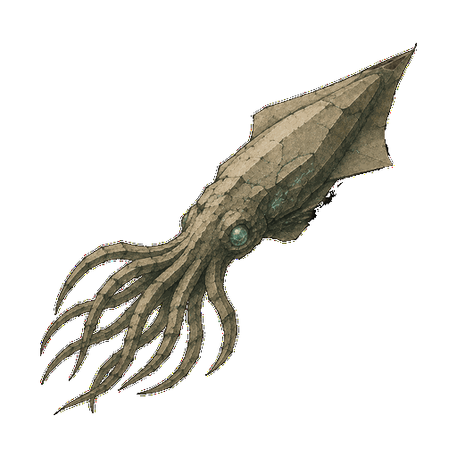 |
| `attack-teleport-slash` <small>attack-teleport-slash</small> | 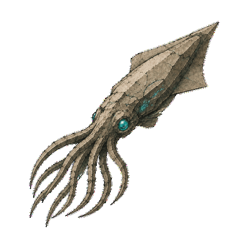 |
| `基礎漂浮／常態移動` <small>base-float-move</small> |  |
| `死亡 90 度沉落` <small>death-collapse-90</small> |  |
| `受擊紅遮罩` <small>hit-red-mask</small> | 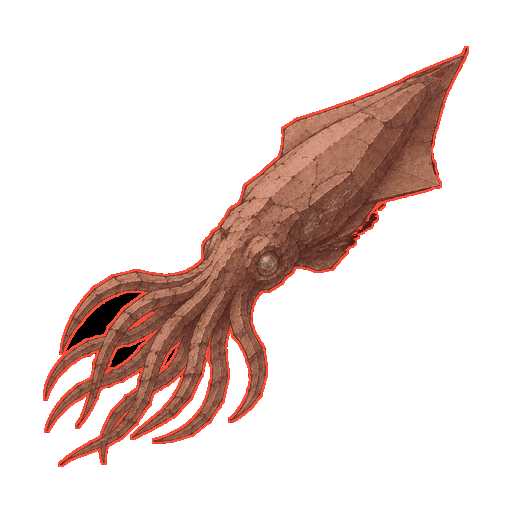 |
| `projectile-ink-shot` <small>projectile-ink-shot</small> | 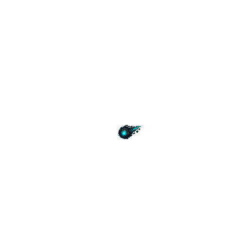 |

### 螃蟹守衛

| 圖組 | GIF 預覽 |
|---|---|
| `attack-claw-swing` <small>attack-claw-swing</small> | 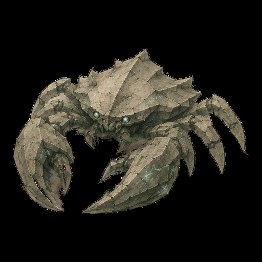 |
| `attack-dash-clamp` <small>attack-dash-clamp</small> |  |
| `基礎漂浮／常態移動` <small>base-float-move</small> | 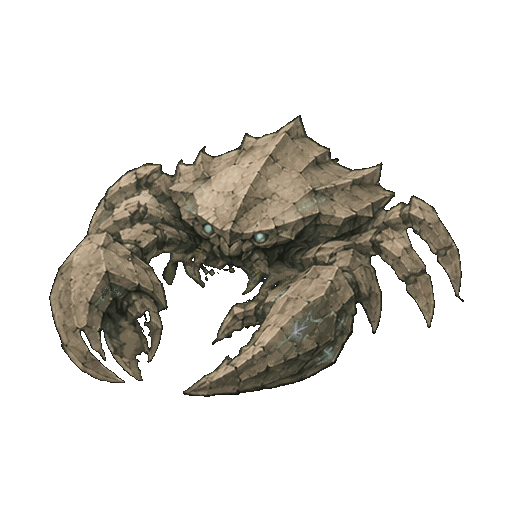 |
| `死亡 90 度沉落` <small>death-collapse-90</small> | 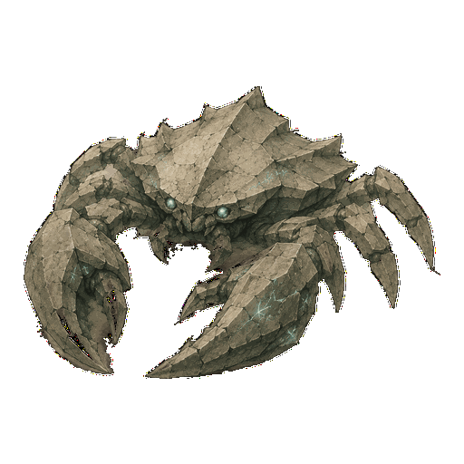 |
| `受擊紅遮罩` <small>hit-red-mask</small> |  |

### 龍蝦士兵

| 圖組 | GIF 預覽 |
|---|---|
| `attack-claw-thrust` <small>attack-claw-thrust</small> | 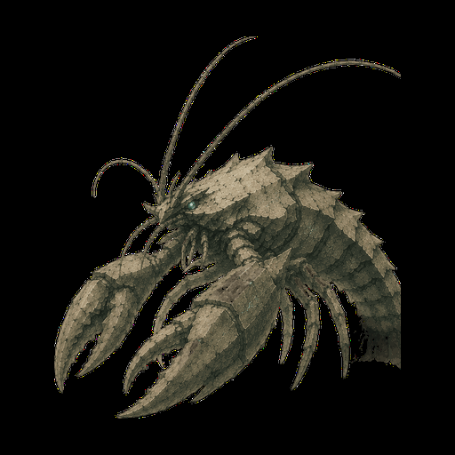 |
| `attack-spear-throw` <small>attack-spear-throw</small> | 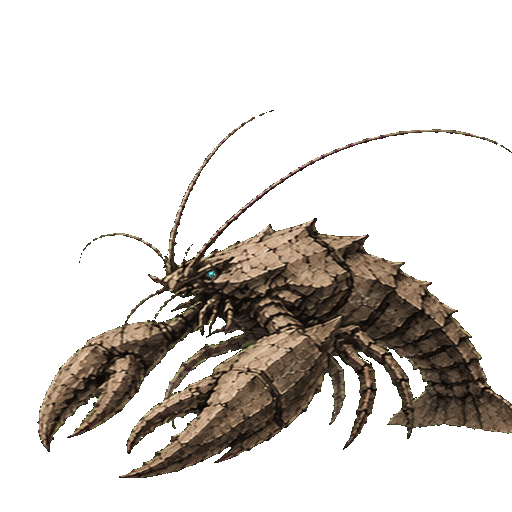 |
| `基礎漂浮／常態移動` <small>base-float-move</small> | 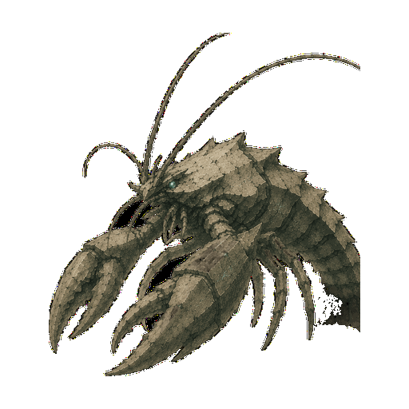 |
| `死亡 90 度沉落` <small>death-collapse-90</small> |  |
| `受擊紅遮罩` <small>hit-red-mask</small> |  |
| `projectile-coral-spear` <small>projectile-coral-spear</small> | 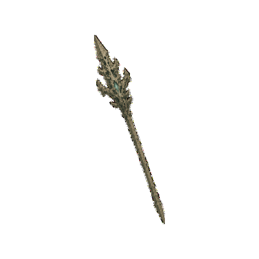 |

## Level 3

### 弧潮獵鰩

| 圖組 | GIF 預覽 |
|---|---|
| `attack-arc-tide-bombardment` <small>attack-arc-tide-bombardment</small> | 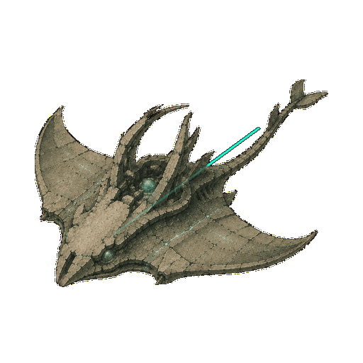 |
| `attack-fin-blade` <small>attack-fin-blade</small> | 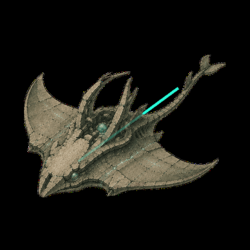 |
| `基礎漂浮／常態移動` <small>base-float-move</small> | 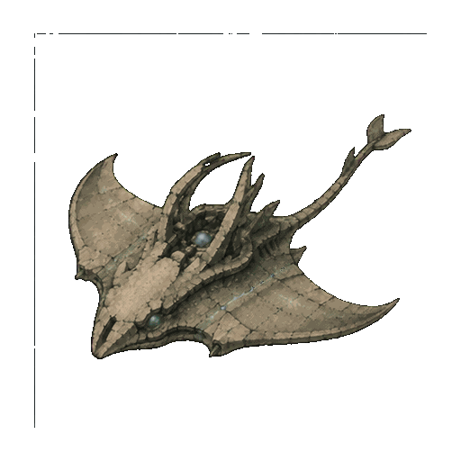 |
| `死亡 180 度旋轉` <small>death-rotate-180</small> | 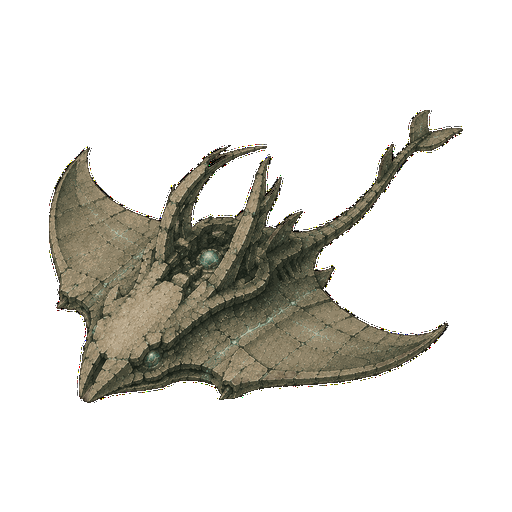 |
| `effect-impact-warning` <small>effect-impact-warning</small> | 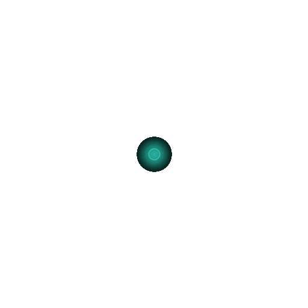 |
| `受擊紅遮罩` <small>hit-red-mask</small> | 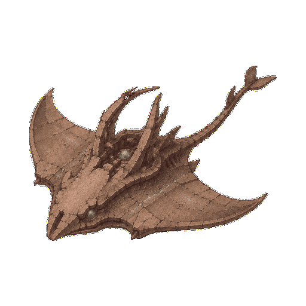 |
| `projectile-arc-tide-shell` <small>projectile-arc-tide-shell</small> |  |

### 珊瑚背海馬

| 圖組 | GIF 預覽 |
|---|---|
| `基礎漂浮／常態移動` <small>base-float-move</small> | 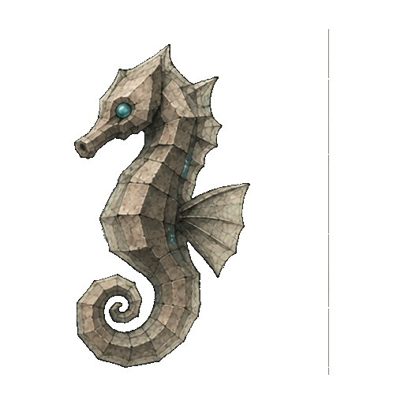 |
| `死亡 90 度旋轉` <small>death-rotate-90</small> | 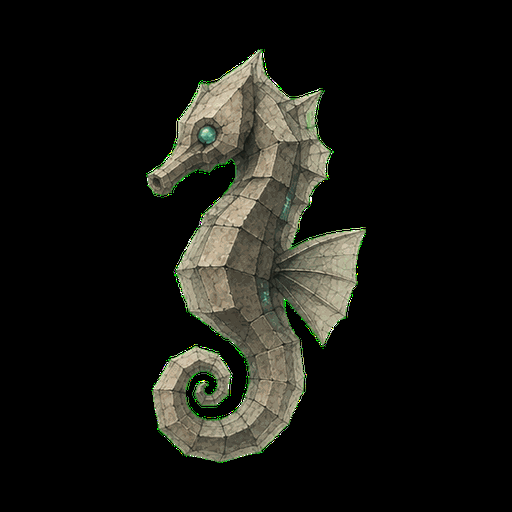 |
| `effect-life-link` <small>effect-life-link</small> |  |
| `受擊紅遮罩` <small>hit-red-mask</small> | 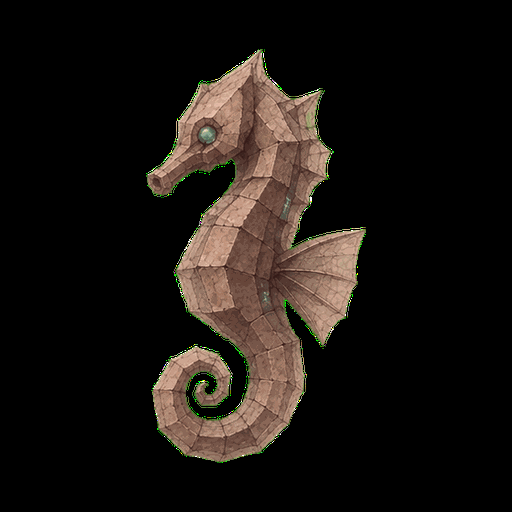 |
| `skill-invulnerability` <small>skill-invulnerability</small> | 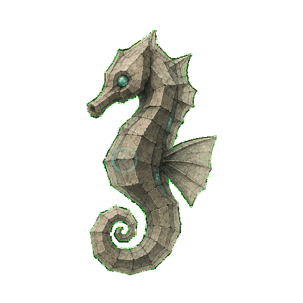 |
| `skill-life-link` <small>skill-life-link</small> |  |

### 裂殖燈籠魚

| 圖組 | GIF 預覽 |
|---|---|
| `attack-split-chase` <small>attack-split-chase</small> | 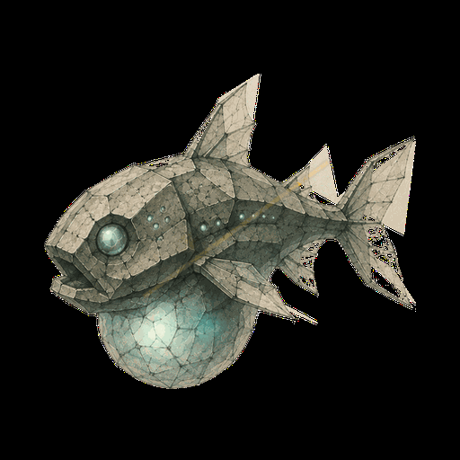 |
| `基礎漂浮／常態移動` <small>base-float-move</small> | 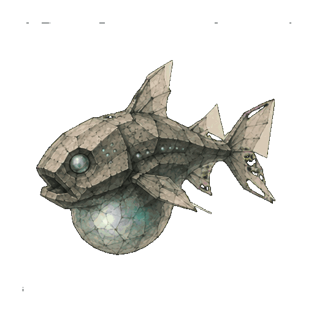 |
| `死亡 180 度旋轉` <small>death-rotate-180</small> | 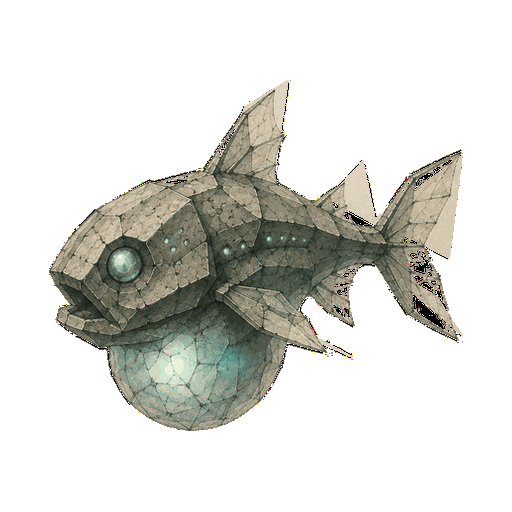 |
| `effect-split-child` <small>effect-split-child</small> | 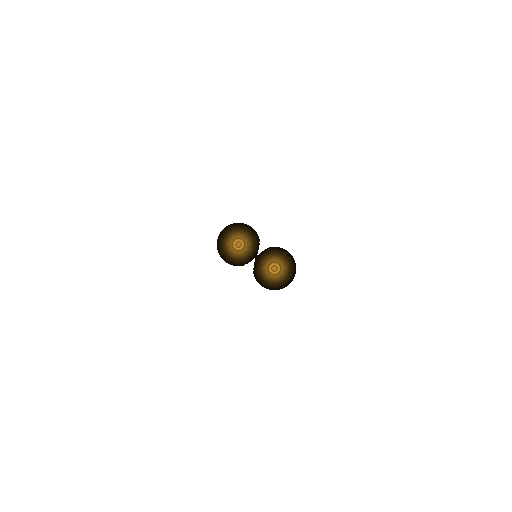 |
| `受擊紅遮罩` <small>hit-red-mask</small> | 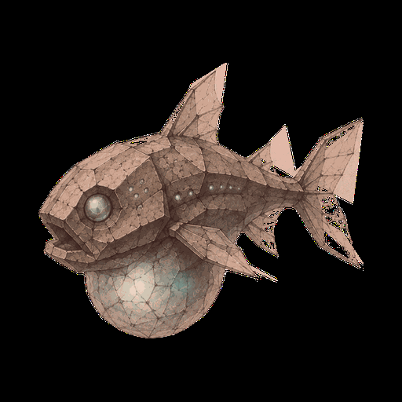 |
| `skill-split-burst` <small>skill-split-burst</small> | 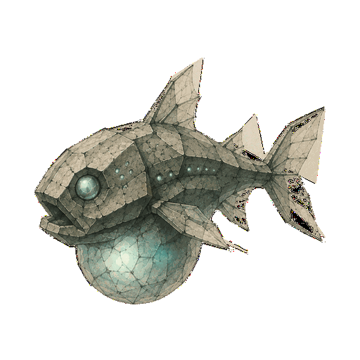 |

### 蝦蛄戰將

| 圖組 | GIF 預覽 |
|---|---|
| `attack-punch` <small>attack-punch</small> | 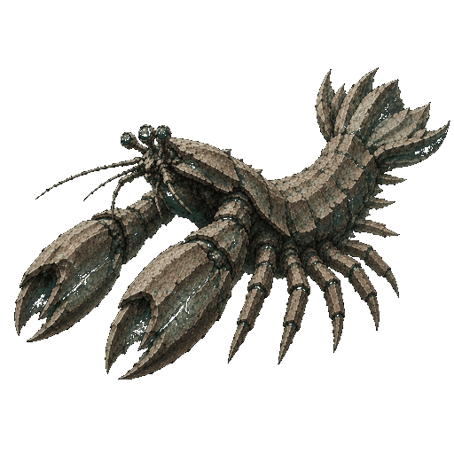 |
| `基礎漂浮／常態移動` <small>base-float-move</small> | 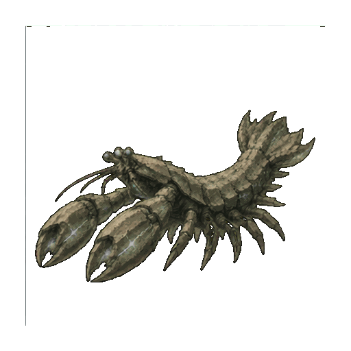 |
| `死亡 180 度旋轉` <small>death-rotate-180</small> | 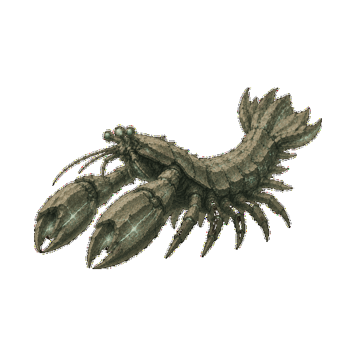 |
| `effect-stun-ripple` <small>effect-stun-ripple</small> | 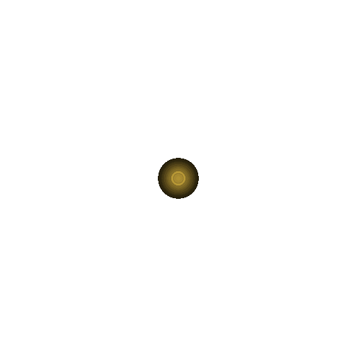 |
| `受擊紅遮罩` <small>hit-red-mask</small> | 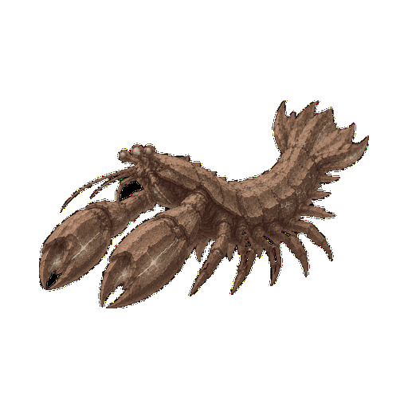 |
| `projectile-beacon` <small>projectile-beacon</small> | 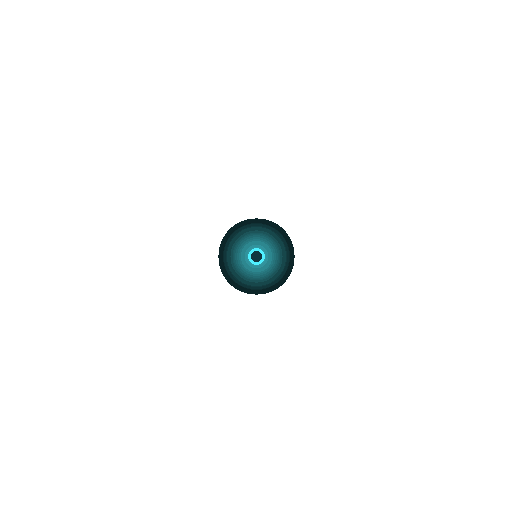 |
| `skill-beacon-assault` <small>skill-beacon-assault</small> | 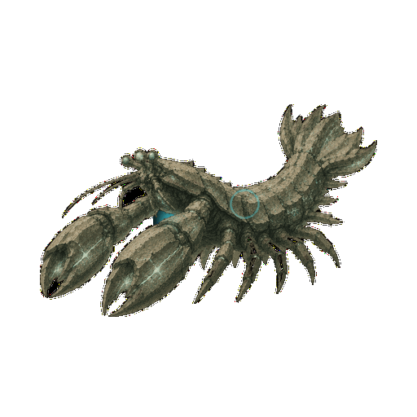 |
| `skill-ground-smash` <small>skill-ground-smash</small> |  |

### 鸚鵡螺祭司

| 圖組 | GIF 預覽 |
|---|---|
| `attack-relic-cast` <small>attack-relic-cast</small> | 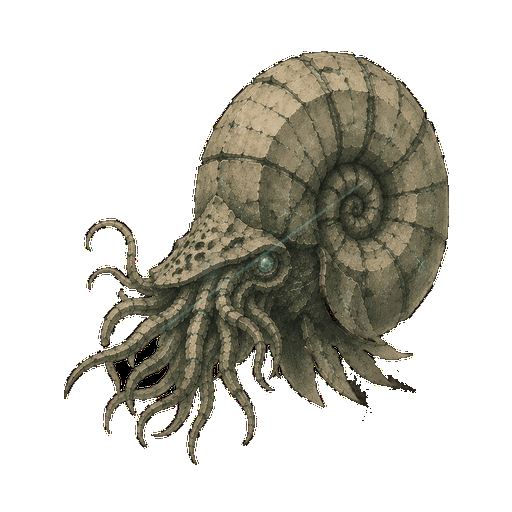 |
| `基礎漂浮／常態移動` <small>base-float-move</small> | 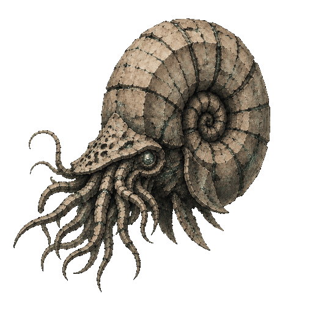 |
| `死亡 90 度旋轉` <small>death-rotate-90</small> | 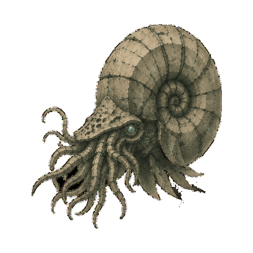 |
| `受擊紅遮罩` <small>hit-red-mask</small> | 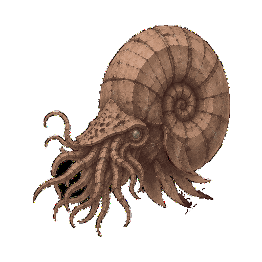 |
| `projectile-coral-shell` <small>projectile-coral-shell</small> | 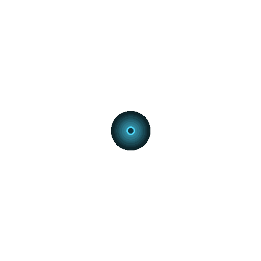 |
| `projectile-twin-core` <small>projectile-twin-core</small> | 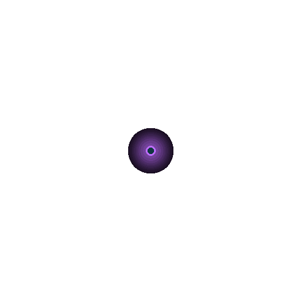 |
| `skill-coral-bombardment` <small>skill-coral-bombardment</small> | 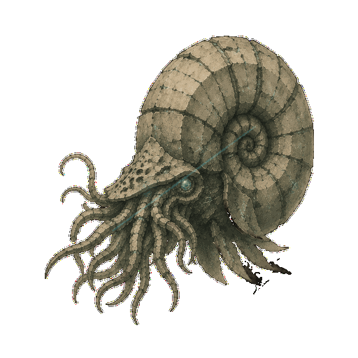 |
| `skill-twin-core-shot` <small>skill-twin-core-shot</small> |  |

## Level 4

### 變異弧潮獵鰩

| 圖組 | GIF 預覽 |
|---|---|
| `attack-pressure-blade-aftershock` <small>attack-pressure-blade-aftershock</small> | 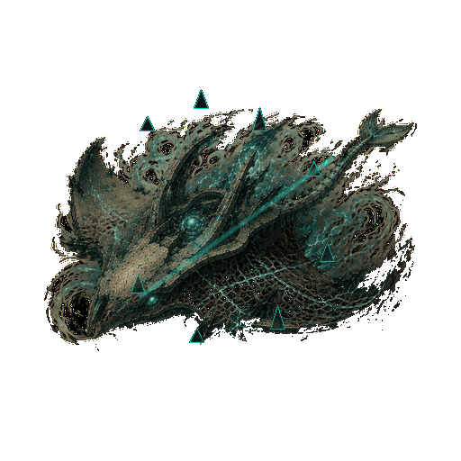 |
| `effect-pressure-mark` <small>effect-pressure-mark</small> |  |
| `projectile-water-pressure-blade` <small>projectile-water-pressure-blade</small> | 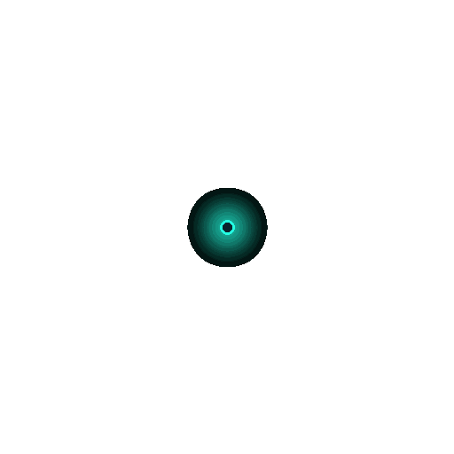 |
| `skill-secondary-pressure-burst` <small>skill-secondary-pressure-burst</small> | 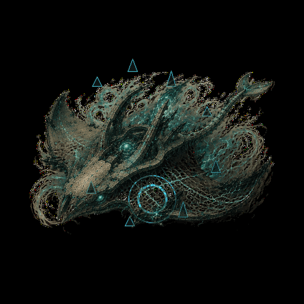 |
| `variant-rage-crystal` <small>variant-rage-crystal</small> | 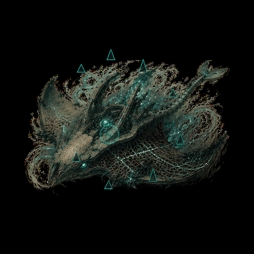 |

### 變異蝦蛄戰將

| 圖組 | GIF 預覽 |
|---|---|
| `attack-tracking-punch` <small>attack-tracking-punch</small> | 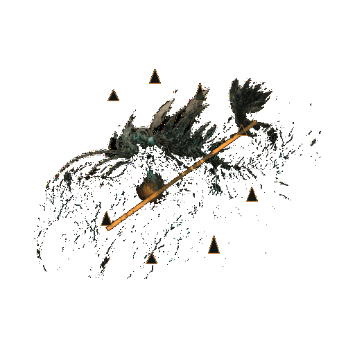 |
| `effect-pressure-arena` <small>effect-pressure-arena</small> | 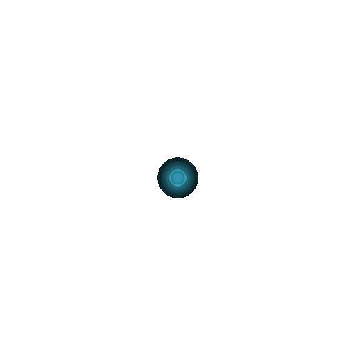 |
| `projectile-tracking-punch` <small>projectile-tracking-punch</small> | 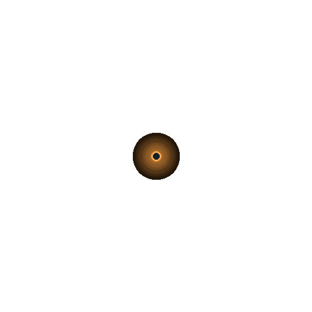 |
| `skill-beacon-afterimage` <small>skill-beacon-afterimage</small> | 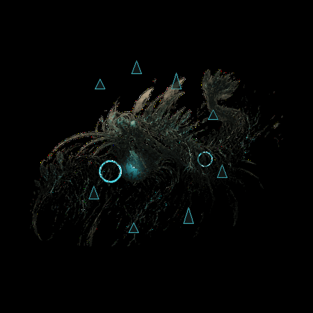 |
| `skill-pressure-arena` <small>skill-pressure-arena</small> | 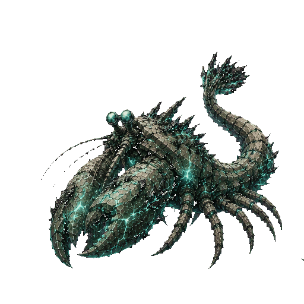 |
| `variant-rage-crystal` <small>variant-rage-crystal</small> | 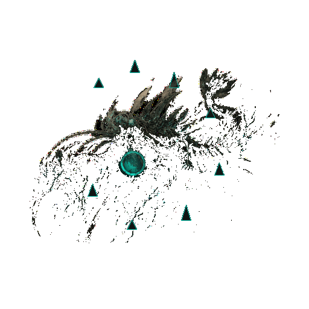 |

### 變異鸚鵡螺祭司

| 圖組 | GIF 預覽 |
|---|---|
| `attack-overloaded-relic` <small>attack-overloaded-relic</small> | 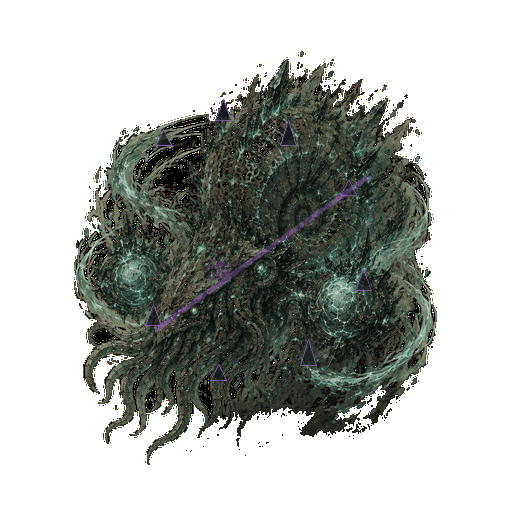 |
| `projectile-coral-shell` <small>projectile-coral-shell</small> | 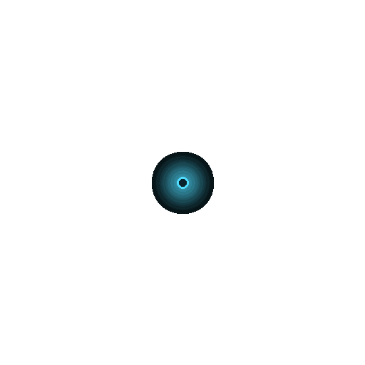 |
| `projectile-twin-core` <small>projectile-twin-core</small> | 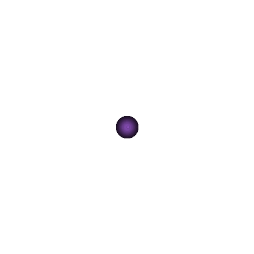 |
| `skill-360-core-scatter` <small>skill-360-core-scatter</small> | 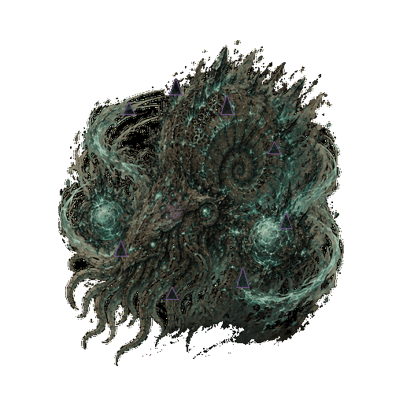 |
| `skill-everlasting-core` <small>skill-everlasting-core</small> | 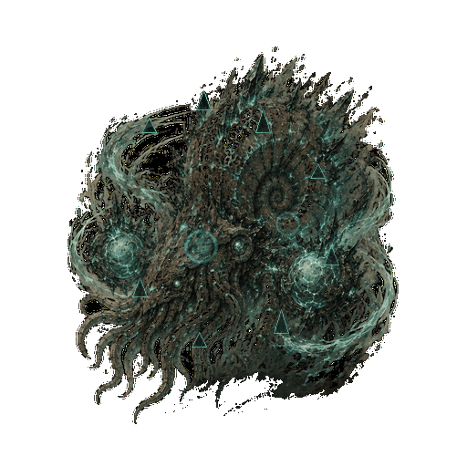 |
| `variant-rage-crystal` <small>variant-rage-crystal</small> | 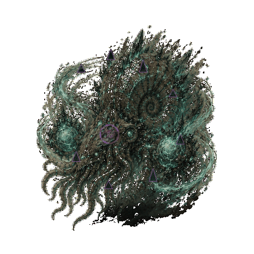 |
